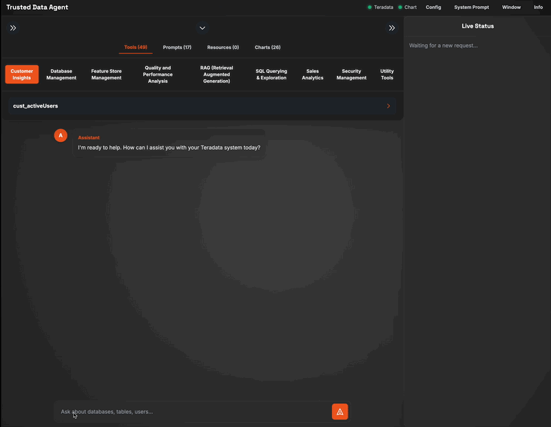

# The Trusted Data Agent
### industry-leading AI Conversational Engine for your most complex enterprise data.

The **Trusted Data Agent** represents a paradigm shift in how Business Leaders, Business Analysts, Developers, and Architects interact with complex data ecosystems. It is a sophisticated engine backend & web front-end application designed not only to showcase AI-powered interaction with a Relational Information system, but to serve as a powerful, fully transparent "study buddy" for mastering the integration of Large Language Models (LLMs) with enterprise data.

This solution provides unparalleled, real-time insight into the complete conversational flow between the user, the AI agent, the **Model Context Protocol (MCP)** server, and the underlying relational information system, establishing a new standard for clarity and control in AI-driven data analytics.



---

### 📋 Table Of Contents

1. [Overview: A Superior Approach](#-overview-a-superior-approach)
2. [Key Features](#-key-features)
3. [The Heart of the Application - The Optimizer](#-the-heart-of-the-application---the-engine--its-fusion-optimizer)
4. [How It Works: Architecture](#-how-it-works-architecture)
5. [Installation and Setup Guide](#-installation-and-setup-guide)
6. [Developer Mode: Unlocking Models](#-developer-mode-unlocking-models)
7. [User Guide](#-user-guide)
8. [Context Maintenance](#context-maintenance)
9. [Application REST API](#-application-rest-api)
10. [Troubleshooting](#-troubleshooting)
11. [License](#-license)
12. [Author & Contributions](#✍️-author--contributions)
13. [Appendix: Feature Update List](#appendix-feature-update-list)

---

## 💡 Overview: A Superior Approach

The Trusted Data Agent transcends typical data chat applications by placing ultimate control and understanding in the hands of the user. It provides a seamless natural language interface to your Relational Information system, empowering you to ask complex questions and receive synthesized, accurate answers without writing a single line of SQL.

Its core superiority lies in its revolutionary architecture, which delivers:

* **Deep Insights:** Go beyond black-box AI. With complete conversational transparency, rich data rendering, and integrated charting, the agent provides an unparalleled, real-time window into the AI's reasoning process, building trust and accelerating development.

* **A Revolutionary Optimizer:** This is not just an LLM wrapper. The agent features a multi-layered optimization engine with strategic planning, autonomous self-correction, and proactive safeguards. It intelligently navigates errors, optimizes execution paths, and protects against common LLM pitfalls, ensuring resilient and efficient operation.

* **Unprecedented Flexibility:** The agent is designed for dynamic control. From an intuitive conversational UI to on-the-fly capability management and a powerful System Prompt Editor, the application adapts to your needs, not the other way around.

* **Comparative LLM Analysis:** In a rapidly evolving AI landscape, the ability to benchmark and compare models is critical. The agent allows for seamless, real-time switching between top-tier LLM providers, including local models, providing an essential platform for enterprise-grade testing and validation.

* **Voice-to-Text Interaction:** Engage with your data naturally through a high-quality, voice-driven interface. Featuring flexible interaction modes, the agent allows for a fluid, hands-free conversational experience.

## ✨ Key Features

### Deep Insights

* **Complete Transparency**: The **Live Status** panel is a real-time window into the AI's mind, revealing its strategic plan, tactical decisions, tool selection, and the raw data it receives. This makes it an indispensable tool for debugging, learning, and building trust in AI systems.

* **Dynamic Capability Loading**: Automatically discovers and displays all available **Tools**, **Prompts**, and **Resources** from the connected MCP Server, giving you an instant overview of the agent's potential.

* **Rich Data Rendering**: Intelligently formats and displays various data types, including query results in interactive tables, SQL DDL in highlighted code blocks, and key metrics in summary cards.

* **Integrated Charting Engine**: Data visualization capabilities are enabled by default, allowing the agent to render insightful charts based on query results directly in the chat interface.

* **Token Usage Tracking**: The application tracks and displays the number of input and output tokens for each LLM call, providing clear insight into the cost and efficiency of each interaction.

### Unprecedented Flexibility

* **Intuitive Conversational UI**: Ask questions in plain English to query and analyze your database. The agent is designed to understand natural language and execute complex requests.

* **Dynamic Capability Management**: Enable or disable any MCP Tool or Prompt directly from the UI. Disabled capabilities are immediately hidden from the agent's context, allowing for safe testing and phased rollouts of new features without a server restart.

* **System Prompt Editor**: Take full control of the agent's behavior. An integrated editor allows privileged users to modify, save, and reset the core system prompt that dictates the agent's persona and rules for each model.

* **Programmatic REST API**: Automate and integrate agent workflows with a comprehensive, asynchronous REST API for configuration and querying.

* **Direct Model Chat**: A dedicated chat interface allows for direct, tool-less conversations with the configured LLM, invaluable for testing a model's baseline reasoning without the complexity of the agent's tool-use logic.

* **Variable Context Modes**: Switch between `Full Context Mode` (default) for comprehensive conversations and `Last Turn Mode` (via hotkey) to force the agent to re-evaluate a query using only the most recent exchange, perfect for iterative refinement.

### Comparative LLM Analysis

* **Multi-Provider LLM Configuration**: Dynamically switch between LLM providers like **Google**, **Anthropic**, **Microsoft Azure**, **AWS Bedrock**, **Friendli.AI**, and **Ollama**. Configure API keys, hosts, and select from available models directly in the UI.

* **Support for Microsoft Azure**:

  * **Azure OpenAI Service**: Connect directly to your deployed models (e.g., GPT-4, GPT-3.5-Turbo) on the Azure OpenAI Service, leveraging the enterprise-grade security and scalability of the Azure cloud.

* **Support for AWS Bedrock**:

  * **Foundation Models**: Directly access and utilize foundational models available on Bedrock.

  * **Inference Profiles**: Connect to custom, provisioned, or third-party models via Bedrock Inference Profiles.

* **Ollama (Local LLM) Integration**: Run the agent with open-source models on your local machine for privacy, offline use, and development.

* **Live Model Refresh**: Fetch an up-to-date list of supported models from your provider with the click of a button.

* **Comparative MCP Testing**: The multi-provider support is crucial for testing and validating how different LLMs interpret and utilize the same set of MCP tools and prompts, providing essential insights into model behavior and capability robustness.

### Voice-to-Text Interaction

* **High-Quality Speech API**: Utilizes Google's robust Text-to-Speech API for clear, natural-sounding audio output.

* **Interactive Voice Recognition**: Employs the browser's Speech Recognition API for seamless voice input, enabling hands-free conversation with the agent.

* **Flexible Voice Modes**: Control the conversational flow with configurable modes for handling "Key Observations"—play them automatically, ask for confirmation before playing, or disable them entirely.

## 🧠 The Heart of the Application - The Engine & its Fusion Optimizer

The Trusted Data Agent is engineered to be far more than a simple LLM wrapper. Its revolutionary core is the **Fusion Optimizer**, a multi-layered engine designed for resilient, intelligent, and efficient task execution in complex enterprise environments. It transforms the agent from a mere tool into a reliable analytical partner.

### The Multi-Layered Planning Process

The Optimizer deconstructs every user request into a sophisticated, hierarchical plan.

1. **Strategic Planner**: For any non-trivial request, the agent first generates a high-level **meta-plan**. This strategic blueprint outlines the major phases required to fulfill the user's goal, such as "Phase 1: Gather table metadata" followed by "Phase 2: Analyze column statistics."

2. **Tactical Execution**: Within each phase, the agent operates tactically, determining the single best next action (a tool or prompt call) to advance the plan.

3. **Recursive Delegation**: The Planner is fully recursive. A single phase in a high-level plan can delegate its execution to a new, subordinate instance of the Planner. This allows the agent to solve complex problems by breaking them down into smaller, self-contained sub-tasks, executing them, and then returning the results to the parent process.

### Proactive Optimization Engine

Before and during execution, the Optimizer actively seeks to enhance performance and efficiency.

* **Plan Hydration**: The agent intelligently inspects a new plan to see if its initial steps require data that was already generated in the *immediately preceding turn*. If so, it "hydrates" the new plan by injecting the previous results, skipping redundant tool calls and delivering answers faster.

* **Tactical Fast Path**: For simple, single-tool phases where all required arguments are known, the Optimizer bypasses the tactical LLM call entirely and executes the tool directly, dramatically reducing latency.

* **Specialized Orchestrators**: The agent is equipped with programmatic orchestrators to handle common complex patterns. For example, it can recognize a date range query (e.g., "last week") and automatically execute a single-day tool iteratively for each day in the range.

* **Context Distillation**: To prevent context window overflow with large datasets, the agent automatically distills large tool outputs into concise metadata summaries before passing them to the LLM for planning, ensuring robust performance even with enterprise-scale data.

### Autonomous Self-Correction & Healing

When errors occur, the Optimizer initiates a sophisticated, multi-tiered recovery process.

1. **Pattern-Based Correction**: The agent first checks for known, recoverable errors (e.g., "table not found," "column not found").

2. **Targeted Recovery Prompts**: For these specific errors, it uses highly targeted, specialized prompts that provide the LLM with the exact context of the failure and guide it toward a precise correction (e.g., "You tried to query table 'X', which does not exist. Here is a list of similar tables...").

3. **Generic Recovery & Replanning**: If the error is novel, the agent falls back to a generic error-handling mechanism or, in the case of persistent failure, can escalate to generating an entirely new strategic plan to achieve the user's goal via an alternative route.

### Robust Safeguards

The Optimizer is built with enterprise-grade reliability in mind.

* **Deterministic Plan Validation**: Before execution begins, the agent deterministically validates the LLM-generated meta-plan for common structural errors (e.g., misclassifying a prompt as a tool) and corrects them, preventing entire classes of failures proactively.

* **Hallucination Prevention**: Specialized orchestrators detect and correct "hallucinated loops," where the LLM incorrectly plans to iterate over a list of strings instead of a valid data source. The agent semantically understands the intent and executes a deterministic, correct loop instead.

* **Definitive Error Handling**: The agent recognizes unrecoverable errors (e.g., database permission denied) and halts execution immediately, providing a clear explanation to the user instead of wasting resources on futile retry attempts.

## ⚙️ How It Works: Architecture

The application operates on a sophisticated client-server model, ensuring a clean separation of concerns and robust performance.

```
+----------+      +-------------------------+      +------------------+      +----------------------+      +------------------+
|          |      |                         |      |                  |      |                      |      |                  |
| End User | <--> |  Frontend (index.html)  | <--> | Backend (Python) | <--> | Large Language Model | <--> |       MCP        |
|          |      |    (HTML, JS, CSS)      |      |  (Quart Server)  |      |  (Reasoning Engine)  |      |  Server (Tools)  |
|          |      |                         |      |                  |      |                      |      |                  |
+----------+      +-------------------------+      +------------------+      +----------------------+      +------------------+

```

1. **Frontend (`templates/index.html`):** A sleek, single-page application built with HTML, Tailwind CSS, and vanilla JavaScript. It captures user input and uses Server-Sent Events (SSE) to render real-time updates from the backend.

2. **Backend** (`src/trusted_data_agent/`): A high-performance asynchronous web server built with **Quart**. It serves the frontend, manages user sessions, and orchestrates the entire AI workflow.

3. **Large Language Model (LLM):** The reasoning engine. The backend dynamically initializes the connection to the selected LLM provider (e.g., Google, Anthropic, Microsoft Azure, AWS Bedrock, Friendli.AI) based on user-provided credentials and sends structured prompts to the model's API.

4. **MCP Server:** The **Model Context Protocol (MCP)** server acts as the secure, powerful bridge to the database, exposing functionalities as a well-defined API of "tools" for the AI agent.

### Code Structure

The Python source code is organized in a standard `src` layout for better maintainability and scalability.

```
/trusted-data-agent/
|
├── src/
|   └── trusted_data_agent/    # Main Python package
|       ├── api/               # Quart web routes
|       ├── agent/             # Core agent logic (Executor, Formatter)
|       ├── llm/               # LLM provider interaction
|       ├── mcp/               # MCP server interaction
|       ├── core/              # Config, session management, utils
|       └── main.py            # Application entry point
|
├── templates/
|   └── index.html             # Frontend UI
|
├── pyproject.toml             # Project definition
├── requirements.txt
└── ...

```

This structure separates concerns, making it easier to navigate and extend the application's functionality.

## 🚀 Installation and Setup Guide

### Prerequisites

* **Python 3.8+** and `pip`.

* Access to a running **MCP Server**.

* An **API Key** from a supported LLM provider or a **local Ollama installation**. The initial validated providers are **Google**, **Anthropic**, **Amazon Web Services (AWS)**, **Friendli.AI**, and **Ollama**.

  * You can obtain a Gemini API key from the [Google AI Studio](https://aistudio.google.com/app/apikey).

  * You can obtain a Claude API key from the [Anthropic Console](https://console.anthropic.com/dashboard).

  * For **Azure**, you will need an **Azure OpenAI Endpoint**, **API Key**, **API Version**, and a **Model Deployment Name**.

  * For AWS, you will need an **AWS Access Key ID**, **Secret Access Key**, and the **Region** for your Bedrock service.

  * For Ollama, download and install it from [ollama.com](https://ollama.com/) and pull a model (e.g., `ollama run llama2`).

### Step 1: Clone the Repository

```
git clone [https://github.com/rgeissen/trusted-data-agent.git](https://github.com/rgeissen/trusted-data-agent.git)
cd trusted-data-agent

```

### Step 2: Set Up the Python Environment

It is highly recommended to use a Python virtual environment.

1. **Create and activate a virtual environment:**

   ```
   # For macOS/Linux
   python3 -m venv venv
   source venv/bin/activate
   
   # For Windows
   python -m venv venv
   .\venv\Scripts\activate
   
   ```

2. **Install the required packages:**

   ```
   pip install -r requirements.txt
   
   ```

### Step 3: Create the Project Configuration File

In the project's root directory, create a new file named `pyproject.toml`. This file is essential for Python to recognize the project structure.

Copy and paste the following content into `pyproject.toml`:

```
[project]
name = "trusted-data-agent"
version = "0.1.0"
requires-python = ">=3.8"

[build-system]
requires = ["setuptools>=61.0"]
build-backend = "setuptools.build_meta"

[tool.setuptools.packages.find]
where = ["src"]

```

### Step 4: Install the Application in Editable Mode

This crucial step links your source code to your Python environment, resolving all import paths. **Run this command from the project's root directory.**

```
pip install -e .

```

The `-e` flag stands for "editable," meaning any changes you make to the source code will be immediately effective without needing to reinstall.

### Step 5: Configure API Keys (Optional)

You can either enter your API keys in the UI at runtime or, for convenience during development, create a `.env` file in the project root. The application will automatically load these keys.

```
# For Google Models
GEMINI_API_KEY="YOUR_GEMINI_API_KEY_HERE"

# For Anthropic Models
ANTHROPIC_API_KEY="YOUR_ANTHROPIC_API_KEY_HERE"

# For Microsoft Azure Models
AZURE_API_KEY="YOUR_AZURE_API_KEY"
AZURE_ENDPOINT="YOUR_AZURE_ENDPOINT_URL"
AZURE_DEPLOYMENT_NAME="YOUR_MODEL_DEPLOYMENT_NAME"
AZURE_API_VERSION="YYYY-MM-DD"

# For AWS Bedrock Models
AWS_ACCESS_KEY_ID="YOUR_AWS_ACCESS_KEY_ID"
AWS_SECRET_ACCESS_KEY="YOUR_AWS_SECRET_ACCESS_KEY"
AWS_REGION="your-bedrock-region"

# For Friendli.AI Models
FRIENDLI_API_KEY="YOUR_FRIENDLI_API_KEY_HERE"

# For Ollama (Local)
OLLAMA_HOST="http://localhost:11434"

```

### Running the Application

**Important:** All commands must be run from the project's **root directory**.

#### Standard Mode

For standard operation with the certified models:

```
python -m trusted_data_agent.main

```

## 👨‍💻 Developer Mode: Unlocking Models

To enable all discovered models for testing and development purposes, start the server with the `--all-models` flag.

```
python -m trusted_data_agent.main --all-models

```

**Note:** **No Ollama models are currently certified.** For testing purposes, Ollama models can be evaluated by starting the server with the `--all-models` developer flag.

## 📚 User Guide

This guide provides a walkthrough of the main features of the Trusted Data Agent UI.

### 1. Initial Configuration

Before you can interact with the agent, you must configure the connection to your services.

1. **Open the App:** After running the application, navigate to `http://12.0.0.1:5000` in your browser. The **Configuration** modal will appear automatically.

2. **MCP Server:** Enter the **Host**, **Port**, and **Path** for your running MCP Server.

3. **LLM Provider:** Select your desired LLM Provider (e.g., Google, Anthropic, OpenAI, Microsoft, Friendli.AI, Ollama).

4. **Credentials:**

   * For cloud providers, enter your **API Key**.

* For **Azure**, provide your **Endpoint URL**, **API Key**, **API Version**, and **Deployment Name**.

* For AWS, provide your **Access Key ID**, **Secret Access Key**, and **Region**.

* For Ollama, provide the **Host URL** (e.g., `http://localhost:11434`).

5. **Fetch Models:** Click the refresh icon next to the model dropdown to fetch a list of available models from your provider.

6. **Select a Model:** Choose a specific model from the dropdown list.

7. **Connect:** Click the **"Connect & Load"** button. The application will validate the connections and, if successful, load the agent's capabilities.

### 2. The Main Interface

The UI is divided into several key areas:

* **History Panel (Left):** Lists all your conversation sessions. You can click to switch between them or start a new chat with the "+" button.

* **Capabilities Panel (Top):** This is your library of available actions, organized into tabs:

  * **Tools:** Single-action functions the agent can call (e.g., `base_tableList`).

  * **Prompts:** Pre-defined, multi-step workflows the agent can execute (e.g., `qlty_tableQualityReport`).

  * **Resources:** Other available assets from the MCP server.

* **Chat Window (Center):** This is where your conversation with the agent appears.

* **Chat Input (Bottom):** Type your questions in natural language here.

* **Live Status Panel (Right):** This is the transparency window. It shows a real-time log of the agent's internal monologue, the tools it decides to run, and the raw data it gets back.

### 3. Asking a Question

Simply type your request into the chat input at the bottom and press Enter.

* **Example:** `"What tables are in the DEMO_DB database?"`

The agent will analyze your request, display its thought process in the **Live Status** panel, execute the necessary tool (e.g., `base_tableList`), and then present the final answer in the chat window.

### 4. Using Prompts Manually

You can directly trigger a multi-step workflow without typing a complex request.

1. Go to the **Capabilities Panel** and click the **"Prompts"** tab.

2. Browse the categories and find the prompt you want to run (e.g., `base_tableBusinessDesc`).

3. Click on the prompt. A modal will appear asking for the required arguments (e.g., `db_name`, `table_name`).

4. Fill in the arguments and click **"Run Prompt"**.

The agent will execute the entire workflow and present a structured report.

### 5. Customizing the Agent's Behavior

You can change how the agent thinks and behaves by editing its core instructions.

1. Click the **"System Prompt"** button in the top navigation bar.

2. The editor modal will appear, showing the current set of instructions for the selected model.

3. You can make any changes you want to the text.

4. Click **"Save"** to apply your changes. The agent will use your new instructions for all subsequent requests in the session.

5. Click **"Reset to Default"** to revert to the original, certified prompt for that model.

### 6. Direct Chat with the LLM

To test the raw intelligence of a model without the agent's tool-using logic, you can use the direct chat feature.

1. Click the **"Chat"** button in the top navigation bar.

2. A modal will appear, allowing you to have a direct, tool-less conversation with the currently configured LLM. This is useful for evaluating a model's baseline knowledge or creative capabilities.

## 🧠 Context Maintenance

The Trusted Data Agent provides several advanced features for managing the context that is sent to the Large Language Model (LLM). Understanding and using these features can help you refine the agent's behavior, save costs by reducing token count, and get more accurate results.

### Understanding Context Elements

The agent's "memory" is composed of three distinct context elements:

1.  **LLM Conversation History (`chat_object`):** This is the raw, turn-by-turn dialogue between you and the agent. It provides the immediate conversational context, allowing the agent to understand follow-up questions and references to previous messages.

2.  **Chat History (`session_history`):** This history is used exclusively for rendering the conversation in the user interface. It is **not** sent to the LLM for context.

3.  **Turn Summaries (`workflow_history`):** This is a structured summary of the agent's actions. For each turn, it includes the plan that was generated, the tools that were executed, and a summary of the results. This history is sent to the agent's **planner** to help it make better decisions and learn from past actions.

### Context Management Features

You have several ways to control the agent's context directly from the UI:

#### Activate/Deactivate Turn Context

You can activate or deactivate the context of any individual turn by clicking on the small numbered badge that appears on the user ("U") and assistant ("A") avatars.

*   **Clicking a badge** will toggle the `isValid` status for that entire turn.
*   **Inactive turns** are visually dimmed and their conversational history is **completely excluded** from the context sent to the LLM. This is a powerful way to surgically remove parts of the conversation that might be confusing the agent.

#### Purge Context

You can deactivate all previous turns at once by clicking the **Context Indicator** dot in the main header (next to the "MCP" and "LLM" indicators).

*   **Clicking the dot** will prompt you for confirmation.
*   **Upon confirmation,** all past turns in the session will be marked as inactive (`isValid = false`), and the indicator will blink white three times. This effectively resets the agent's conversational and planning memory, forcing it to start fresh from your next query.

#### Replay Original Query

You can re-execute the original query for any turn by **clicking and holding** the assistant ("A") avatar for that turn.

*   **Press and hold for 1.5 seconds.** A circular animation will appear to indicate the action.
*   Upon completion, the agent will re-run the original user query for that turn, generating a brand new plan. This is useful for retrying a failed turn or exploring an alternative approach.

### Context Modes

The agent provides two primary modes for handling conversational history, allowing you to control the context sent to the LLM for each query. You can see the current mode in the hint text below the chat input bar.

**Important Note:** In both modes, only turns that are currently **active** (`isValid = true`) are included in the context. Deactivated turns are completely ignored by the LLM and the planner.

#### Full Session Context Mode (Default)

In this mode, the agent maintains a complete conversational memory. It sends the **LLM Conversation History (`chat_object`)** from all active turns with each new request.

*   **Best for:** Conversational queries, follow-up questions, and tasks that require the agent to remember the back-and-forth of the dialogue.
*   **Impact:** Uses more tokens, as the conversation history from all active turns is included in the context.

#### Turn Summaries Mode

When activated, this mode disables the **LLM Conversation History**. The agent becomes conversationally "stateless" but still operates with full knowledge of its past actions from active turns.

*   **What it sends:**
    1.  The Current User Prompt.
    2.  The **Turn Summaries (`workflow_history`)** from all active turns.
    3.  The full System Prompt (including all available tools).
*   **Best for:** "One-shot" commands, saving tokens, or preventing a long, complex conversation from confusing the planner.
*   **How to activate:**
    *   **Hold `Alt`** while sending a message to use it for a single query.
    *   **Press `Shift` + `Alt`** to lock the mode on for subsequent queries.

## 🔌 Application REST API

The Trusted Data Agent includes a powerful, asynchronous REST API to enable programmatic control, automation, and integration into larger enterprise workflows.

This API exposes the core functionalities of the agent, allowing developers to build custom applications, automate complex analytical tasks, and manage the agent's configuration without using the web interface.

### Key Capabilities

* **Asynchronous Architecture**: The API is built on a robust, task-based pattern. Long-running queries are handled as background jobs, preventing timeouts and allowing clients to poll for status and retrieve results when ready.

* **Programmatic Configuration**: Automate the entire application setup process. The API provides an endpoint to configure LLM providers, credentials, and the MCP server connection, making it ideal for CI/CD pipelines and scripted deployments.

* **Full Agent Functionality**: Create sessions and submit natural language queries or execute pre-defined prompts programmatically, receiving the same rich, structured JSON output as the web UI.

For complete technical details, endpoint definitions, and cURL examples, please see the full documentation:
[**REST API Documentation (docs/RestAPI/restAPI.md)**](https://github.com/rgeissen/trusted-data-agent/blob/main/docs/RestAPI/restAPI.md)

## 🛠️ Troubleshooting

* **`ModuleNotFoundError`:** This error almost always means you are either (1) not in the project's root directory, or (2) you have not run `pip install -e .` successfully in your active virtual environment.

* **Connection Errors:** Double-check all host, port, path, and API key information. Ensure no firewalls are blocking the connection. If you receive an API key error, verify that the key is correct and has permissions for the model you selected.

* **"Failed to fetch models":** This usually indicates an invalid API key, an incorrect Ollama host, or a network issue preventing connection to the provider's API.

* **AWS Bedrock Errors:**

  * Ensure your AWS credentials have the necessary IAM permissions (`bedrock:ListFoundationModels`, `bedrock:ListInferenceProfiles`, `bedrock-runtime:InvokeModel`).

  * Verify that the selected model is enabled for access in the AWS Bedrock console for your specified region.

## 📜 License

This project is licensed under the GNU Affero General Public License v3.0. The full license text is available in the `LICENSE` file in the root of this repository.

Under the AGPLv3, you are free to use, modify, and distribute this software. However, if you run a modified version of this software on a network server and allow other users to interact with it, you must also make the source code of your modified version available to those users. There are 4 License Modes available.

### Description of the 4 License Modes

#### Community and Development Tiers (AGPLv3)

*Tiers 1 through 3 are governed by the GNU Affero General Public License v3.0 (AGPLv3). This is a "strong copyleft" license, meaning any modifications made to the software must be shared back with the community if the software is run on a network. This model fosters open collaboration and ensures that improvements benefit all users.*

##### 1. App Developer --- INCLUDED IN THIS PACKAGE

* **Software License:** GNU Affero General Public License v3.0

* **Intended User:** Software developers integrating the standard, out-of-the-box agent into other AGPLv3-compatible projects.

* **Description:** This tier provides full programmatic access to the agent's general-purpose tools, code and associated architetcture. It is designed for developers who need to use the agent as a standard component in a larger system, with the understanding that their combined work will also be licensed under the AGPLv3. **This is a application developer-focused license; access to prompt editing capabilities is not included.**

##### 2. Prompt Engineer

* **Software License:** GNU Affero General Public License v3.0

* **Intended User:** AI developers and specialists focused on creating and testing prompts for community contribution.

* **Description:** A specialized tier for crafting new prompts and workflows. It provides the necessary tools and diagnostic access to develop new prompts that can be contributed back to the open-source project, enhancing the agent for all AGPLv3 users. **This is a prompt developer-focused license; access to prompt editing capabilities is included.**

##### 3. Enterprise Light

* **Software License:** GNU Affero General Public License v3.0

* **Intended User:** Business users or teams requiring a tailored, but not exclusive, data agent.

* **Description:** This license is for a version of the application that has been **customized for specific business needs** (e.g., a "Financial Reporting" or "Marketing Analytics" package). The only difference between this and the "App Developer" license is that the deliverable is a pre-configured solution rather than a general toolkit. It is ideal for organizations using open-source software that need a solution for a specific, common business function. **This is a usage-focused license; access to prompt editing capabilities is not included.**

#### Commercial Tier (MIT)

##### 4. Enterprise

* **Software License:** **MIT License**

* **Intended User:** Commercial organizations, power users, and data scientists requiring maximum flexibility and control for proprietary use.

* **Description:** This is the premium commercial tier and the only one that **uplifts the software license to the permissive MIT License**. This allows organizations to modify the code, integrate it into proprietary applications, and deploy it without any obligation to share their source code. Crucially, this is also is the **only tier that enables full prompt editing capabilities (including the licensing system for prompts)**, giving businesses complete control to customize and protect their unique analytical workflows and intellectual property. This license is designed for commercial entities that need to maintain a competitive advantage.

## ✍️ Author & Contributions

* **Author/Initiator:** Rainer Geissendoerfer, rainer.geissendoerfer@teradata.com , teradata.com.

* **Source Code & Contributions:** The Trusted Data Agent is licensed under the GNU Affero General Public License v3.0. Contributions are highly welcome. Please visit the main Git repository to report issues or submit pull requests.

* **Git Repository:** <https://github.com/rgeissen/trusted-data-agent.git>

## 📋 Appendix: Feature Update List

This list reflects the recent enhancements and updates to the Trusted Data Agent, as shown on the application's welcome screen.

*   **31-Oct-2025:** Fully configurable Context Management (Turn & Session)
*   **24-Oct-2025:** Turn Replay & Turn Reload Plan
*   **24-Oct-2025:** Stop Button Added - Ability to immediately Stop Workflows
*   **23-Oct-2025:** Robust Multi-Tool Phase Handling
*   **11-Oct-2025:** Friendly.AI Integration
*   **10-Oct-2025:** Context Aware Rendering of the Collateral Report
*   **19-SEP-2025:** Microsoft Azure Integration
*   **18-SEP-2025:** REST Interface for Engine Configuration, Execution & Monitoring
*   **12-SEP-2025:** Significant Formatting Upgrade (Canonical Baseline Model for LLM Provider Rendering)
*   **05-SEP-2025:** Conversation Mode (Google Cloud Credentials required)
